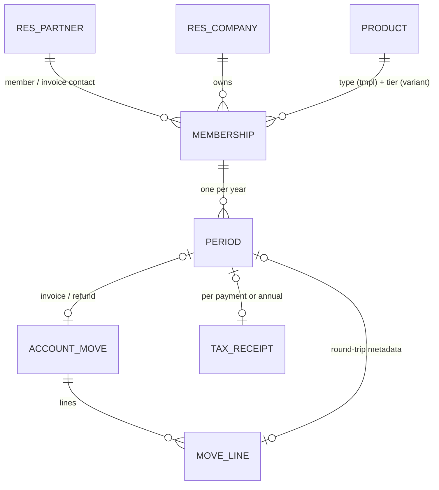
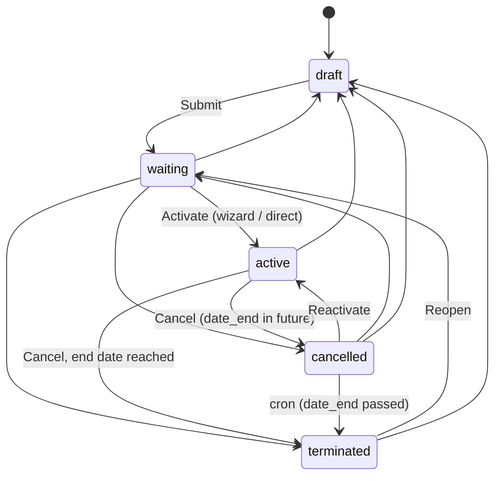
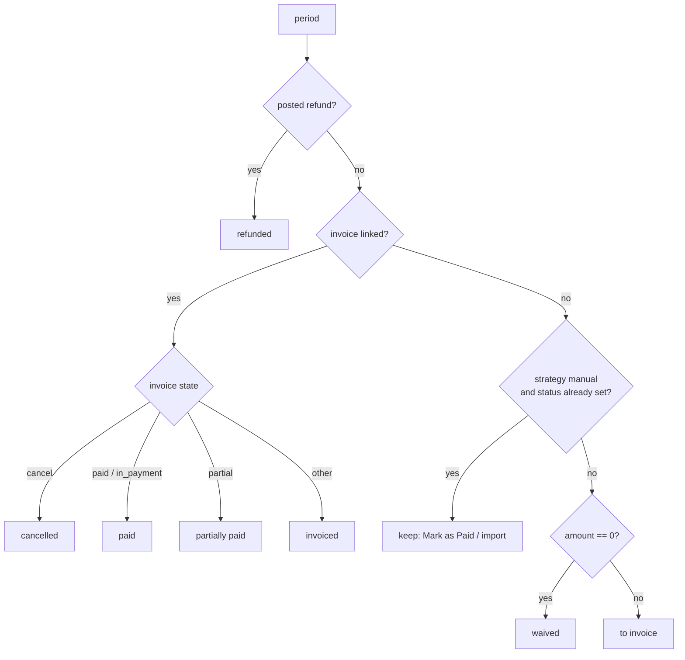
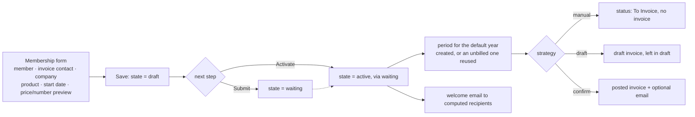
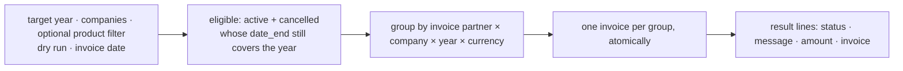
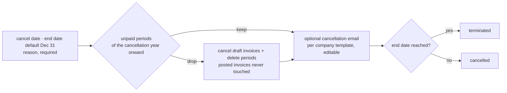

# Association Membership

`association_membership` is a lean Odoo 18 CE module for association membership management in multi-company setups. It models the membership relationship and its yearly billing artifacts on top of standard Odoo accounting and OCA `donation_base`, without forking either.

Multi-company first: settings, sequences, templates and periods are all per company, designed for federation hierarchies (national / regional / local as separate companies).

## Data Model



### `membership.membership`

The relationship between a partner, a company and a membership product. `mail.thread` + `mail.activity.mixin`, `_check_company_auto`, ordered by `date_start desc`.

| Field | Type | Notes |
| --- | --- | --- |
| `name` | Char | computed, stored — display name |
| `partner_id` | M2o `res.partner` | **Member**, required, tracked |
| `invoice_partner_id` | M2o `res.partner` | optional separate invoice contact |
| `company_id` | M2o `res.company` | required, default = current company |
| `product_id` | M2o `product.product` | **tier** (variant), required, tracked |
| `product_tmpl_id` | related, stored | **membership type** (template) |
| `state` | Selection | `draft` / `waiting` / `active` / `cancelled` / `terminated` |
| `date_start` | Date | required, default today |
| `date_end`, `date_cancelled`, `cancel_reason` | Date / Date / Text | only on `cancelled` / `terminated` (constraint) |
| `date_welcome_sent` | Date | set when the welcome mail goes out |
| `membership_active` | Boolean | computed, stored — live today (`active` or `cancelled`) |
| `membership_number` | Char | globally unique (SQL constraint); drawn from the shared counter unless the company opts out |
| `override_membership_number` | Boolean | allows a manual number |
| `membership_number_preview` | Char | computed preview of the next number |
| `amount` | Monetary | computed from the product price, editable per membership |
| `currency_id` | related | company currency |
| `invoicing_strategy` | Selection | empty = follow the company setting |
| `period_ids` | O2m | per-year billing artifacts |
| `period_count`, `last_period_year`, `last_billing_status` | computed | list/kanban columns |
| `duplicate_period_year_warning` | Char | computed UI warning |
| `active` | Boolean | archiving |

Key state sets used by reports, partner filters and the number display:
`BUSINESS_ACTIVE_STATES = (active, cancelled)` · `CURRENT_MEMBER_STATES = (waiting, active, cancelled)`.

### `membership.period`

The per-year billing artifact, one per `(membership, year)` (SQL constraint). Keeps its own `product_id` and `amount` from creation, so later tier changes never rewrite history.

| Field | Type | Notes |
| --- | --- | --- |
| `membership_id` | M2o | required, `ondelete=restrict` |
| `membership_year` | Integer | required; the identity of the period |
| `date_start`, `date_end` | Date | computed, stored — 1 Jan–31 Dec, clipped to the membership |
| `product_id`, `amount` | M2o / Monetary | **frozen at creation**, not re-derived |
| `is_free` | Boolean | computed, stored — `amount == 0` |
| `membership_invoicing_strategy` | Selection | the strategy that actually applied — refreshed while unbilled, then frozen |
| `invoice_id`, `invoice_line_id`, `refund_move_id` | M2o `account.move` / line | |
| `amount_invoiced`, `amount_paid` | Monetary | computed+stored, `readonly=False` (manual mode writes) |
| `date_paid` | Date | manual mode; required for annual tax receipts |
| `date_invoice` | related, stored | from the invoice |
| `billing_status` | Selection | computed+stored, `readonly=False` — see below |
| `tax_receipt_id` | M2o `donation.tax.receipt` | readonly |
| `partner_id`, `company_id`, `currency_id` | related, stored | from the membership |
| `invoice_partner_id`, `note` | M2o / Text | |

### Extended standard models

| Model | Added |
| --- | --- |
| `account.move.line` | `membership_id`, `membership_period_id`, `membership_year` — invoice lines round-trip to periods |
| `account.move` | `_post` / `_invoice_paid_hook` — drive period status and per-payment receipts |
| `account.partial.reconcile` | `unlink` — an unreconciled payment raises a to-do instead of deleting a receipt |
| `product.template` | `membership_ok`, `membership_partner_type` (`any` / `person` / `company`) |
| `product.product` | `_membership_product_domain()`, `_get_membership_price()` |
| `res.partner` | `membership_ids`, `membership_period_ids`, number displays, **Create Membership** |
| `res.company` | all membership settings (see Configuration) |
| `donation.tax.receipt` | `membership_period_ids` + annual collection of paid periods |

## Membership Lifecycle



| State | Meaning | Rules |
| --- | --- | --- |
| `draft` | editable scratch | Periods tab hidden; **only** state that can be deleted; periods forbidden by constraint |
| `waiting` | created, not yet active | periods and invoicing allowed |
| `active` | steady state | |
| `cancelled` | *scheduled to end at `date_end`* | still business-active |
| `terminated` | end state | **Reopen** → `waiting`, clears cancellation data |

- Reverting to `draft` and deleting are blocked once periods exist.
- `date_cancelled` / `date_end` / `cancel_reason` are only valid on `cancelled` / `terminated` and are cleared automatically on revert, reopen or reactivation.
- Re-running a cancel on an already cancelled membership corrects its dates/reason rather than failing.

## Period Billing Status

An invoice, when there is one, always wins — in every strategy. Only without an invoice do strategies differ.



`amount_invoiced` / `amount_paid` follow the invoice line and its residual whenever there is an invoice; in manual mode without one they keep what **Mark as Paid** or the importer wrote.

## Products

- **Template = membership type, variant = tier** (e.g. an employee range). A membership stores the variant; a tier change stays within the membership, a type change means ending it and starting a new one. Open memberships may not overlap per type.
- Products are flagged `membership_ok` with a `membership_partner_type`. A membership may only use a flagged product of exactly its company (or without company) matching the member's partner type.
- The price is `lst_price` (template price + variant `price_extra`) via `_get_membership_price()`. No pricelists.
- Retiring a tier = archiving its variant; the renewal wizard skips those memberships and says so.

## Processes

### Onboarding a new member

**Memberships → New**, or **Create Membership** on the partner form. There is no separate
creation wizard: the form already previews the member number and the fee and filters the
products by partner type.



The welcome email is pre-ticked only for a first activation — never when reactivating a
cancelled membership or activating a reopened one. A fee of 0 cannot be invoiced; the
wizard says so instead of silently skipping it.

### Renewal

**Memberships → Configuration → Renewal** — the wizard is the intended path; the `Membership Renewal` cron exists but is **disabled** by default.



### Cancellation

**Cancel Membership** (active/waiting) or **Edit Cancellation** (already cancelled) → Cancel wizard.



### Tax receipts

Built on `donation_base`: its receipt model, annual wizard and partner option (`tax_receipt_option`: None / Each / Annual). Eligibility per product via `tax_receipt_ok`. Receipts live under **Memberships → Tax Receipts** (accounting users only).

| Mode | Option *Each* | Option *Annual* |
| --- | --- | --- |
| **Invoice** (`draft` / `confirm`) | receipt issued automatically once the invoice is fully `paid` (not `in_payment`) | paid invoices land on the annual receipt |
| **Manual** (no invoice) | no per-payment receipt — collected annually | *Create Annual Receipts* collects paid, eligible periods with a `date_paid` |

Periods without a payment date (e.g. imported history) are never receipted. The annual receipt links the periods it covers (`membership_period_ids`), which are skipped on later runs. A refund or an unreconciled payment does **not** delete a receipt — it adds a to-do activity to reclaim or correct it.

### Scheduled actions

| Cron | Interval | Default | Does |
| --- | --- | --- | --- |
| `Membership Termination` | daily | **enabled** | moves expired-`cancelled` memberships to `terminated` |
| `Membership Renewal` | yearly | disabled | per-company renewal at `current_year + offset` |

### Importing members

Imports run through the repository's `scripts/import_contacts.py`, not through a wizard. The importer uses `action_activate_direct` / `action_cancel_direct` / `action_reopen_waiting` — no wizards, no emails.

### Followers

Neither the creator of a membership nor the sender of a welcome or cancellation email becomes a follower, so staff do not get copies of member emails by default. Follow a membership on purpose to get copies and reply notifications.

## Configuration (per company)

`Settings > Membership`:

| Setting | Field | Default |
| --- | --- | --- |
| Email recipients for organisation members | `membership_company_mail_recipients` | contact person — also: the organisation, invoice contact, or both. Individuals always get their own emails |
| Invoicing strategy | `membership_invoicing_strategy` | `manual` — `draft` / `confirm` create an invoice on activation and renewal; overridable per membership |
| Period year override | `membership_default_period_year` | `0` = current year; a future year pre-creates next year's periods |
| Renewal year offset | `membership_cron_year_offset` | `1` (cron only) |
| Email templates | activation invoice / welcome / cancellation | shipped EN + DE, auto-assigned to companies without one |
| Member numbers | `member_number_prefix` (`%(year)s` supported), `member_number_padding`, next number | prefix and padding decide how the number *looks*; they are per company |
| Own member number counter | `member_number_own_sequence` | **off by default: all companies draw from one shared counter**, so numbers stay unique whatever prefix each association uses. On = this association counts on its own, starting where the shared counter stands |

## Reporting

Pre-built list views: Current / Unpaid / New members, Scheduled to End, Former Members, Period History, Renewal Candidates, Per-company Member List.

The **Members** menu opens the per-membership kanban (one card per membership record). A partner-aggregated overview is intentionally not provided.

## Permissions

| Group | Can |
| --- | --- |
| `group_membership_manager` | full CRUD on memberships and periods, run wizards, edit settings |
| `group_membership_viewer` | read-only memberships and periods, incl. on partner forms |

Creating invoices and tax receipts additionally needs the accounting rights of `account` / `donation_base`.

## Dependencies

`account`, `contacts`, `donation_base`, `mail`, `product`. OCA `partner_contact_address_default` is optional: when installed, its `partner_contact_id` is the contact person for member emails. The German Zuwendungsbestätigung lives in `association_membership_l10n_de`.

## Testing

```bash
./run_tests.sh association_membership
./run_tests.sh association_membership_l10n_de
```

## Planned Improvements (TODOs)

- **Renewal cron** — currently disabled with a hardcoded next call; review enablement and add coverage for the cron-driven per-company renewal path.
- **Archive exposure** — memberships support archiving (`active` field, kanban ribbon) but the form offers no archive/unarchive action.
- **Reporting** — views are list-based only; consider dashboards/KPIs (member growth, churn, revenue per year) on top of periods.
- Open post-launch items are tracked in `docs/membership/association_membership_launch_gaps.md` in the main repository.
